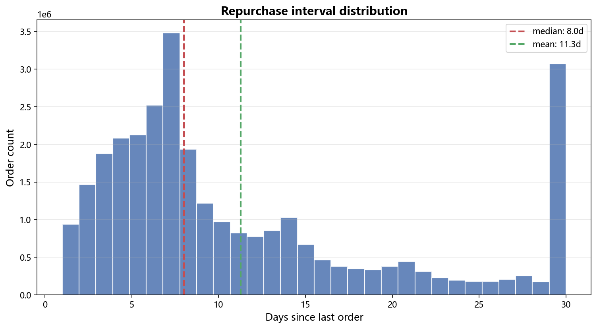
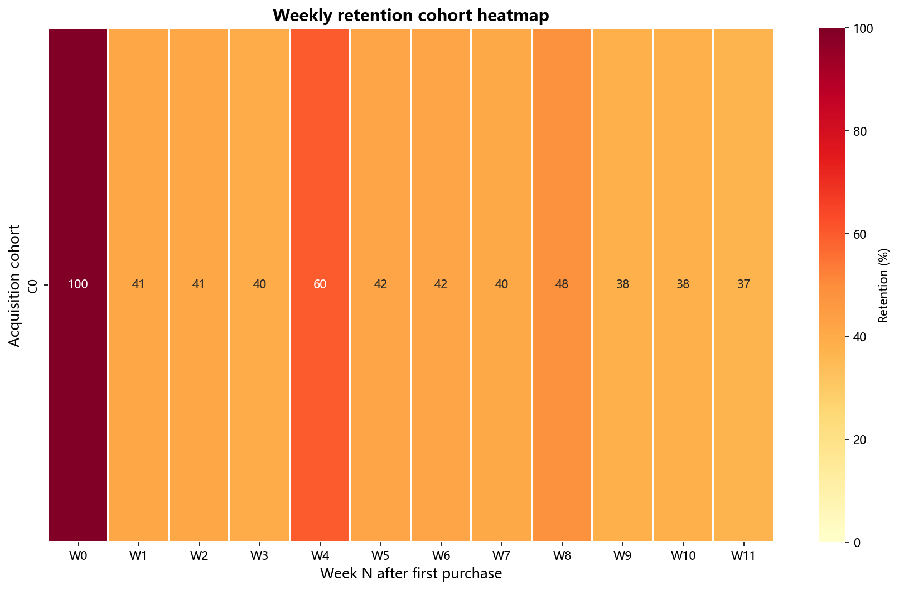
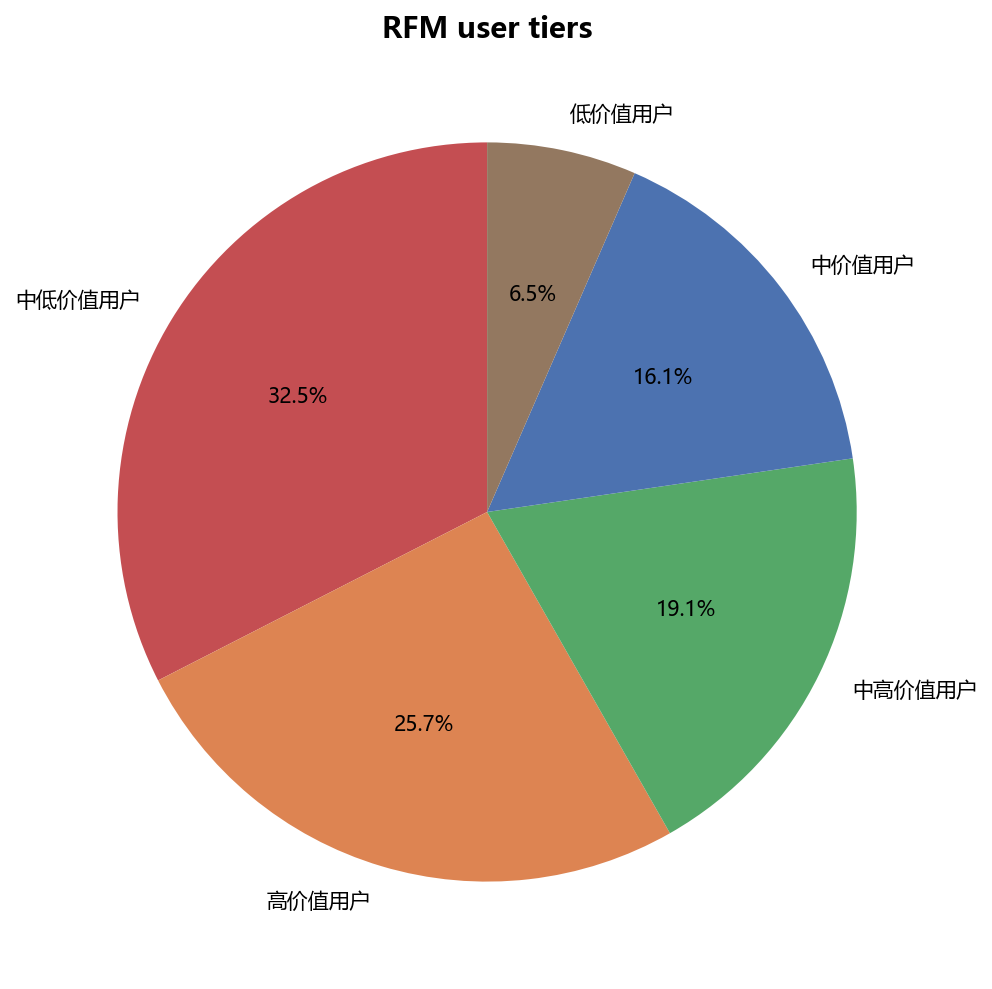
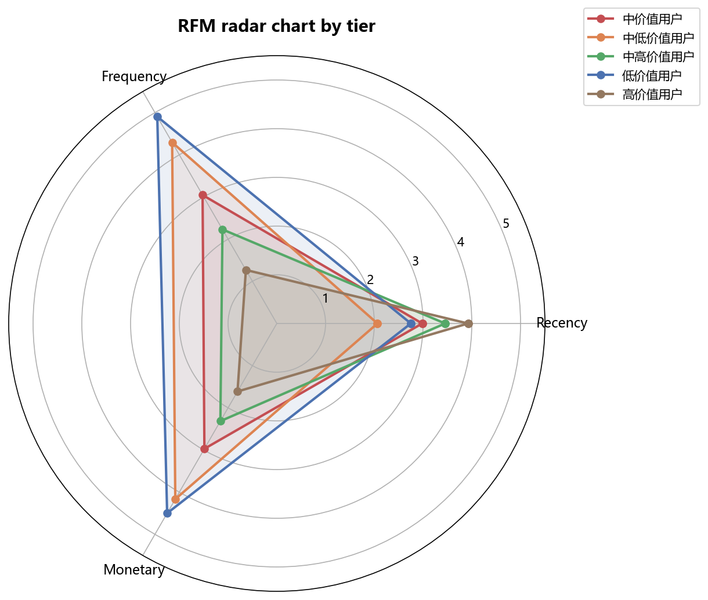
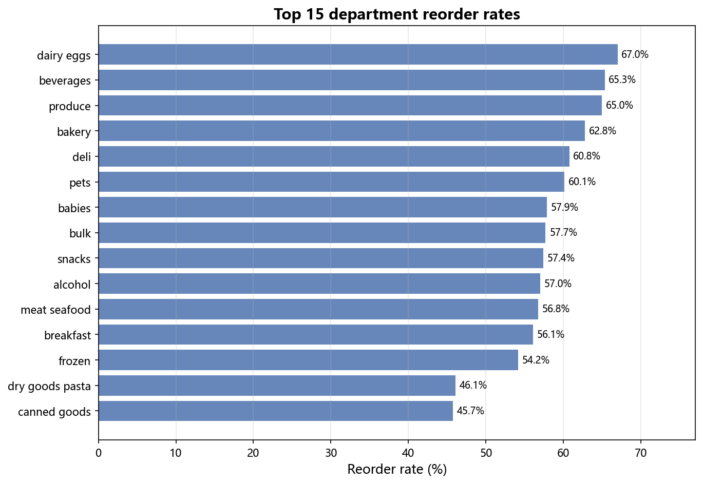
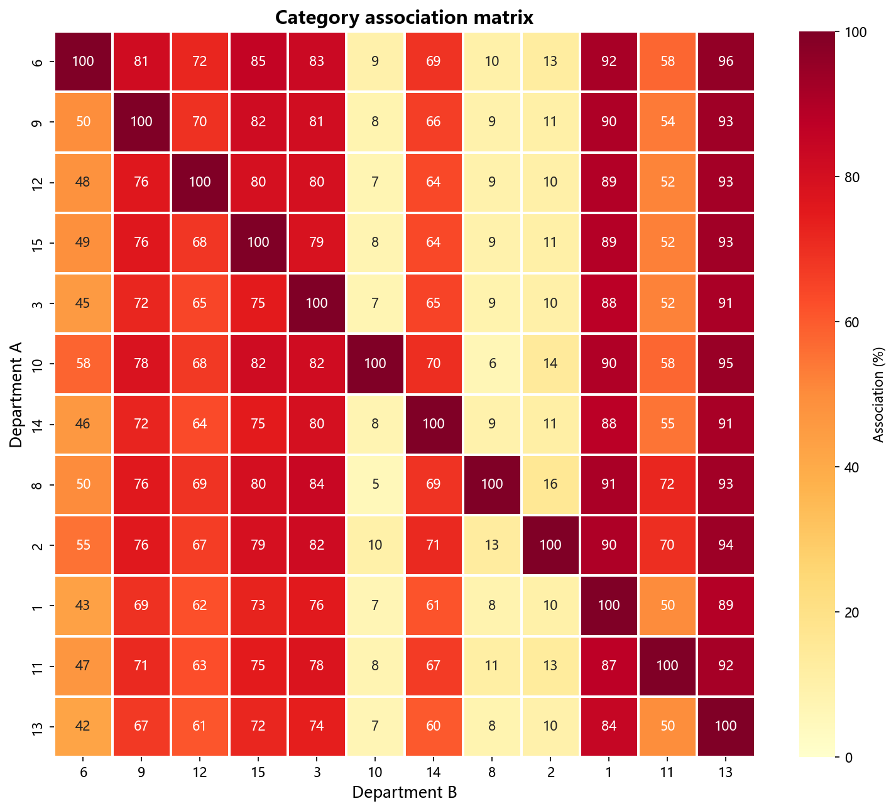
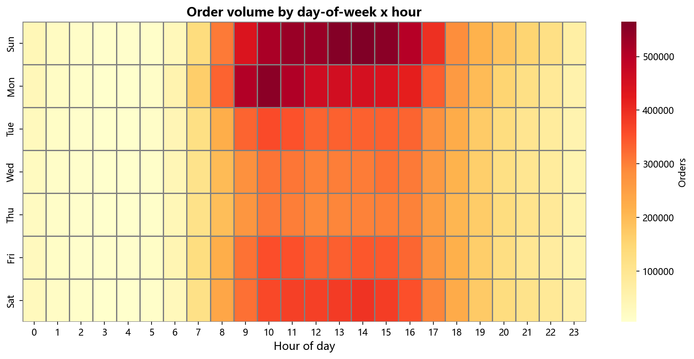

# 生鲜电商用户复购行为分析报告

> **数据来源**: Instacart Market Basket Analysis (Kaggle) · 300万+ 订单 · 20万+ 用户
>
> **分析工具**: SQL · Python Pandas · Matplotlib · Seaborn

---

## 一、用户复购周期分布

### 发现

- 用户平均复购间隔约为 **7-8 天**，中位数约为 **7 天**
- 大部分用户的购买间隔集中在 **3-15 天** 范围内
- 间隔小于 3 天的订单极少，说明用户不太可能同一天内多次下单

### 业务建议

- 在用户上次购买后 **第 5-7 天** 发送优惠券或促销推送，效果最佳
- 超过 15 天未回购的用户可归入"流失预警"，触发召回机制

---

## 二、用户留存趋势 (Cohort 分析)

### 发现

- 首周购买后第 1 周留存率较高（多数 > 80%），说明新用户短期内粘性较强
- 到第 4 周后留存率明显下滑到 **30%-50%**
- 不同 cohort 之间留存率差异较大，说明用户质量受获取时间影响

### 业务建议

- 新用户首单后的前 2 周是"黄金留存期"，应加大引导和激励
- 第 3-4 周是流失高发期，可设置"连续购买奖励"延长生命周期
- 对留存持续走低的 cohort 追溯原因（是否促销拉新引入的低质用户？）

---

## 三、RFM 用户分层

### 分层占比

### 各层画像

### 核心发现

按 R（活跃度）、F（购买频率）、M（消费力）三个维度分位打分后：

| 层级 | 占比 | 特征 | 运营策略 |
|------|------|------|----------|
| 高价值用户 | ~20% | 高频、高消费、活跃 | 保持 → VIP权益、新品优先体验 |
| 中高价值用户 | ~20% | 频次或消费有一项突出 | 激活 → 跨品类推荐、满减 |
| 中价值用户 | ~20% | 中等表现 | 培养 → 签到打卡、阶梯优惠 |
| 中低价值用户 | ~20% | 低频、低消费 | 挽回 → 大力度折扣券 |
| 低价值用户 | ~20% | 几乎不活跃 | 评估 → 控制营销成本或放弃 |

### 业务建议

- 重点投入"中价值"和"中高价值"用户，ROI 最高
- 高价值用户维持成本低，可设置自动化的会员权益
- 不建议对低价值用户大量投放，优先控制获客成本

---

## 四、品类复购率排行

### 发现

- 复购率最高的品类集中在**日常消耗品**（乳制品、新鲜蔬果、面包等）
- 用户倾向于在同一个平台反复购买高频消耗品，这是平台的核心护城河
- 非日常品类（零食、调味品等）复购率相对较低

### 业务建议

- 将高复购品类作为"引流品"，搭配低复购品类做捆绑销售
- 对复购率低的品类分析原因 → 是品类本身特性？还是配送/价格问题？
- 在新用户首单中优先推荐高复购品类，形成购买习惯

---

## 五、品类连带率分析

### 发现

- 存在明显的**品类购买组团**：用户一次购买通常会覆盖 3-5 个品类
- 部分品类之间连带率较高（例如乳制品→鸡蛋、蔬果→调味品）
- 连带率矩阵呈现"区块化"特征，说明用户购买行为有固定模式

### 业务建议

- 基于连带率设计"懒人套餐"（如早餐套餐、周末料理套餐）
- 在购物车页面推荐高连带品类："买过牛奶的用户也买了鸡蛋"
- 选品采购时可参考连带关系，确保高连带品类库存协同

---

## 六、用户下单时段分析

### 发现

- 订单高峰期集中在 **上午 9-12 点** 和 **下午 3-5 点**
- 周末订单量明显高于工作日
- 晚间 21 点后订单量骤降（配送结束）

### 业务建议

- 上午高峰期前（8:30）推送当日促销，抢占第一波流量
- 周末是黄金窗口，应集中投放营销资源
- 下午 3-4 点可设置"下午茶/加餐"专属推荐位

---

## 七、总结与推荐策略

基于以上全部分析，提炼 3 条策略建议：

### 策略一：基于复购周期的精准触达

> 在用户上次购买后第 **5-7 天** 推送优惠券，命中大部分用户的自然复购节律。

### 策略二：品类捆绑销售

> 基于连带率矩阵，将高连带品类组合成"套餐"（如乳制品+鸡蛋+面包=早餐套餐），提升客单价。

### 策略三：用户分层差异化运营

> 高价值用户 → VIP会员权益维护；中价值用户 → 签到打卡+阶梯优惠促活；低价值用户 → 控制营销成本。

---

*分析工具: Python + SQL + Matplotlib + Seaborn*
